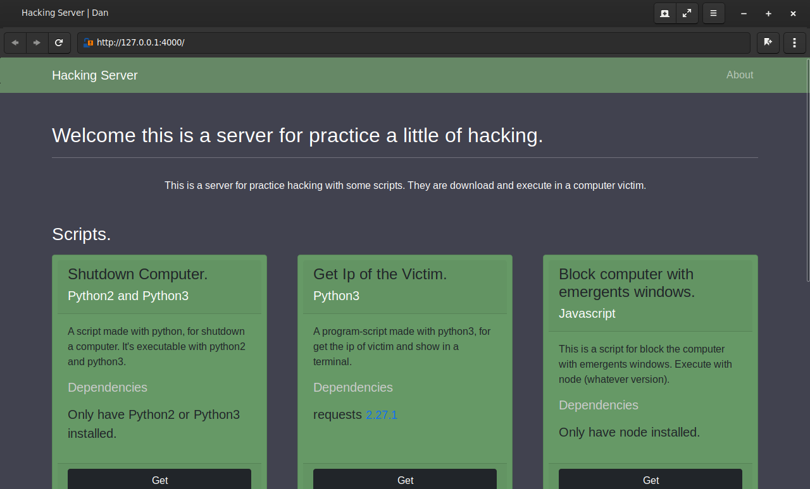

# Hacking Server.

__A Server made with python3 using flask framework and bootstrap like css framework.__

## Installation.
```bash
$ git clone https://www.github.com/EduardYan/hacking-server.git/

$ cd hacking-server/

```

## Dependencies.

__Install the dependencies with the requirements file. In this case install with pip, you can use
other packages managers.__

```bash
$ pip3 install -r requirements.txt
```

## Configuration.

__You have 2 files configurations to use. The first is 'config.json' that file have some
configurations for the server and the path for the scripts in the server (very important write it correctly).
And the file 'scripts_info.json', here you can set the information for the scripts to show in the page.__

_If you modifid some keys of this files, maybe you will give a error!_

### Default Configuration for 'config.json'.
```json
{
  "PORT": 4000,
  "SCRIPTS_PATH": [
    "./static/scripts/shutdown-computer.py",
    "./static/scripts/get-ip.py",
    "./static/scripts/emergents-windows.js",
    "./static/scripts/http-blocker.py"
  ]
}
```

## Running.

__Only execute the file index.py__

```bash
$ python3 index.py
```

## Screenshot.


## Errors or some Problem.
<a href="mailto:eduarygp@gmail.com" target="_blank" rel="noreferrer">
  Contact Me
</a>
